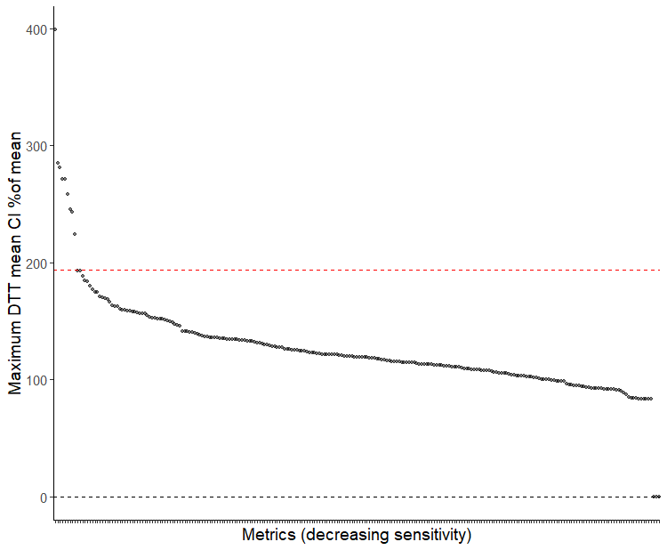
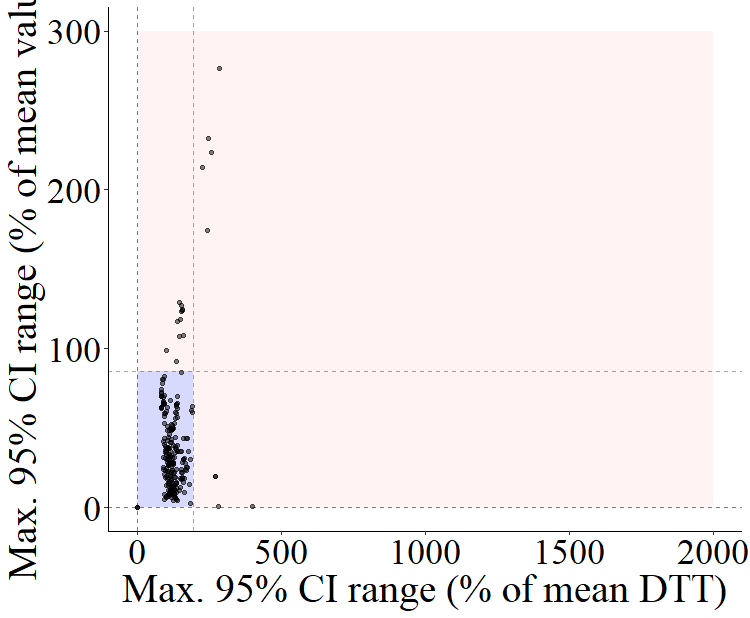
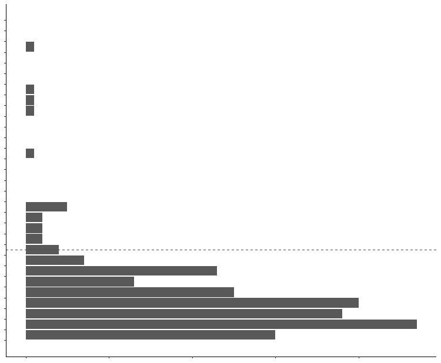
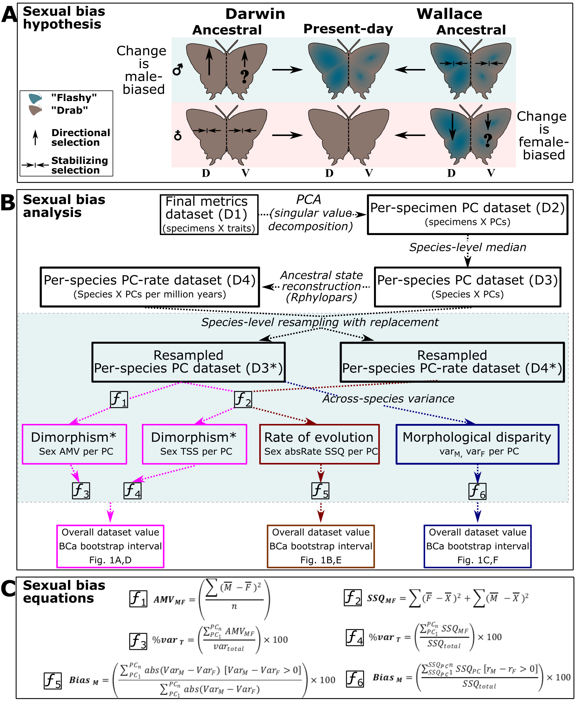
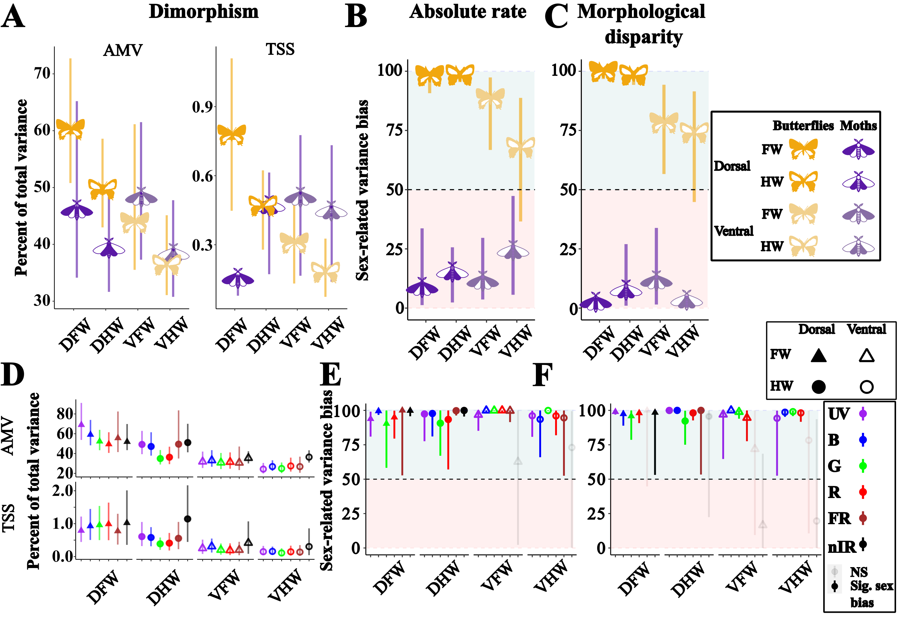
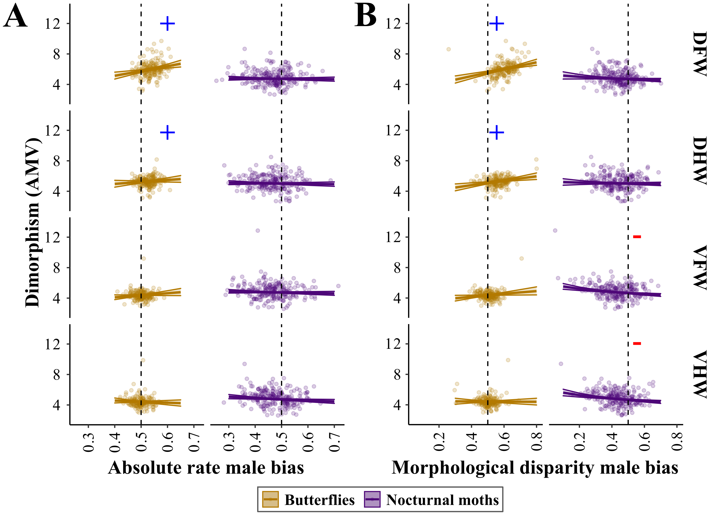

## Multispectral Sex Selection Walkthrough
A walkthrough of the multispectral data processing and sexual selection proxy metrics analysis code and analysis that I conducted for the paper analyzing morphological proxies of sexual selection that show Darwinian male-biased evolution of sexual dimorphism in day- vs night -flying lepidoptera. The pipeline and analysis is written as a series of python or R scripts, submitted as individual scripts in a SLURM HPC environment via sbatch. Plotting scripts are run locally in Rstudio.

**Figure 1: Graphical outline of the entire analysis pipeline.**

---

### Introduction
This repository contains a guided walkthrough of the data analysis and pipeline I developed in our study, which uses morphological proxies of sexual selection based on multispectral reflectance, color and pattern information to determine whether butterfly wing color and pattern evolution conforms more broadly to a Darwinian model of male-biased evolution based on female choice or Wallacean mode of female-biased evolution based on sex-specific natural selection. I begin by augmenting the reflectance based trait metrics produced by our multispectral imaging pipeline (Chan, Rabideau Childers and Ashe, _et al._ 2022, [https://doi.org/10.1038/s42003-022-04282-z]) with custom multispectral 'color-' and pattern-based trait metrics. As this approach is designed to be used with samplings across high-level exemplar phylogenies, I employ a bootstrapping sensitvity analysis to restrict the analysis to those metrics that do not vary too wildly (or at all) across the selected taxonomic scales. I then use PCA via Singular Vector Decomposition to convert the remaining metrics, which by nature are highly intercorrelated with each other and cannot therefore be analyzed independently, into uncorrelated morphological axes of variation. Though direct tests of trait effects on fitness would be preferable, but unfeasible at the scale of a macroevolutionary dataset such as this, I implement my own workflow, quantifying for each axis the sexual dimorphism (by several measures), and male biased rates of evolution or morphological disparity that have been established in previous work as morphological proxies of sexual selection.  Given that these morphological axes are uncorrelated and share a common unit space, sex-based variation can be quantified and summed across these axes to yield overall summaries of the level of dimorphism and sexual bias in absolute rate and morphological disparity across entire taxonomic groups (e.g. 'butterflies,' 'day-flying geometrids' or 'nocturnal moths'), which can be directly compared against findings from other groups or even other studies  by expressing them as a function of the overall morphospace variance.

#### Note
Many script parameters need customization per user. Future script updates will allow passing an overarching prefix argument, but for now, users must manually edit script prefixes, output paths, and filenames.
Additionally, submission code is supplied for all scripts with descriptive placeholder arguments in the form ['description of argument'] (as a string argument example). Just remove the brackets and replace with your own arguments and filenames and you should be set.

---

### Datasets and Scripts
- **Datasets**: Available on [Dryad](FAKELINKREPLACE)
- **Analysis Scripts**: Available on [Zenodo](FAKELINKREPLACE)

---

### Statistical Analysis Walkthrough

---

#### Multispectral 'Color' and Pattern Metrics Calculation

  
**Figure 2: 'Multispectral color palette' metrics.** A) Visible colors of butterflies and moths, color frequency diagrams show true color swatches with swatch size representing frequency of color on the wing. B) Falsecolor color frequency diagram with each swatch representing UV (blue), 740nm (green) and 940nm (red) reflectance, sized by frequency of appearance on wing. A-B annotated with combined butterfly and moth phylogenies combined for illustration purposes. C) Description of multispectral 'color palette' metrics, derived by concatenating coarsely-binned (0-8, instead of 0-255) reflectance values across wavelength bands.

The following code comprises a python script which uses data from '8-bit' color matrices produced by the multispectral imaging pipeline in Chan, Rabideau Childers and Ashe, _et al._ 2022. These are then read in for each specimen side, with each mat file comprised of a series of multispectral 'color names,' essentially a concatenation of the intensity values of each wavelength band ranging in intensity from 1 (0 reflectance) to 8 (maximum reflectance), which are treated as a kind of 'color species' from which a range of color and pattern metrics are calculated, based on ecological diversity, richness and evenness metrics like Shannon-Weaver entropy or multispectral color contrast. See Extended data figures for more details. Arguments include the bodypart (specified in each pixel of the .mat files), as well as the channel start and stops, which determine over which range of the multispectral wavelength bands (UV, B, G, R, 740nm, 940nm) will these metrics be calculated, as well a taxonomic prefix to differentiate from other taxa being studied.


- **Code**: `generalized_color_metrics_alltaxa_FINAL.py`, `commandlineoptions_generalized_color_metrics_py_generalized.sh`

```bash
# Example command for submitting job via sbatch
sbatch commandlineoptions_generalized_color_metrics_py_generalized.sh '/path/to/8bitmatrices/' \
'/path/to/moth_specimen_matrices_list.txt' 'BODYPART' [CHANNEL START] [CHANNEL STOP] 'TAXON'
```

The above sbatch script will be submitted separately for each desired combaintion of channel ranges, body parts and taxa after which it will be compiled using the following code:

#### Compilation of Metrics


- **Code**: generalized_color_metrics_alltaxa_results_compiler_FINAL.py, generalized_color_metrics_alltaxa_results_compiler_py_GENERIC.sh

```bash
# Example command for submitting job via sbatch
sbatch generalized_color_metrics_alltaxa_results_compiler_py_GENERIC.sh 
```
  
The submission should be edited by the user to the correct arguments for -d the directory where the color palette .p files output by the generalized_color_metrics_alltaxa_FINAL.py script are located and -m for the matrix_var_file, a ser supplied csv file with the column names 'Taxon_groups' 'Body_parts' 'Channel_groups' in that order. All are read as strings though body parts are the numeric codes for the different body parts detected by our pipeline. Channel groups must be specified as 'C[x]_to_X[y]'' where x is the start channel and y is the stop channel output by the color palette script (0=UV to 6=nIR).

```python
# Example dataframe generation
Taxon_groups = ['Butterflies', 'Moths']
Body_parts = ['1', '2', '3', '4', '5', '6']
Channel_groups = ['C0_to_C6', 'C0_to_C5', 'C0_to_C4', 'C1_to_C4', 'C5_to_C6']
iteration_frame = pd.DataFrame(list(product(Taxon_groups, Body_parts, Channel_groups )), 
                               columns=['Taxon_groups', 'Body_parts', 'Channel_groups'])
iteration_frame.to_csv('color_palette_metrics_compilation_input_variable_dataframe.csv', index=False)
```


This will then produce a pickle file which is used by the following metadata matching code to produce the final "Trait data frame" used as input to the sensitivity and subsequent analyses.

#### Producing a Final trait data frame by joining combined metrics with user supplied metadata

- **Code**: compile_master_trait_databases_and_split_by_metadata_FINAL.py, generalized_color_metrics_alltaxa_results_compiler_py_GENERIC.sh 

```bash
# Example command for submitting job via sbatch
sbatch generalized_color_metrics_alltaxa_results_compiler_py_GENERIC.sh 
```

this script takes the following options "-c", filename of the color palette .p file output by generalized_color_metrics_alltaxa_results_compiler.py assumes current directory.
"-d", filename of the .csv file in the current directory that lists the complete filenames of the metric datasets to be joined together under a column titled 'Metric_datasets'
"-m", filename of the .csv file in the current directory that lists the complete filenames of the metadata datasets that will be intersected via 'Specimen' values with the compiled data. Requires 'Metadata_datasets' 'Grouping_variables' 'ID_variable' 'Taxon_group' columns. which contain metadata filenames, a list of user supplied grouping variables in the format ['var1','var2',...], the unique species ID variable name and the taxon group name, respectively
"-s" whether to save the overall trait database before splitting by metadata (can be large).

The out of this script is a final trait data frame (or frames, if multiple rows for multiple groups of metadata were supplied to the metadata datasets dataframe.
These can then be analyzed via the sensitivity analyses to restrict further analyses to metrics which are not prone to bad sampling bias at these taxonomic scales.

---

#### Conducting sensitivity analyses to restrict subsequent analyses to only metrics which are not highly sensitive to sampling bias


- **Code**: `WW_sensitivity_analysis_bootstrap_array_commandline_arguments_GENERALIZED.sh`, `Bootstrap_sensitivity_analysis_butterflies_and_moths_ARRAY_GENERALIZED.R`

```bash
# Example sbatch job submission
sbatch --array=1-[NUMBOOTS] /path/to/WW_sensitivity_analysis_bootstrap_array_commandline_arguments_GENERALIZED.sh ['TAXON'] [OFFSET_INT]
```

The above script conducts two sensitivity analyses on the metrics in the final trait dataframes from the previous sections. In each array job, the random seed is set to be the bootstrap value to ensure reproducibility, and then the final trait dataframe is randomly resampled at the specimen level with replacement to simulate different levels of sampling across and within species. The species level medians are then taken from these resampled datasets, and two indices of sensitivity are calculated for eacg trait metric: the across species mean value to determine the effect of sampling bias on overall trait values, and the across species mean disparity through time value as determined by the dtt function of the 'geiger' package, as a means of estimating the impact of sampling bias within a phylogenetic context. The output from each individual array job will be a small dataframe with a column identifying the dataset (body/wing part) and another identifying the original trait metric names, and finally two columns for overall mean and mean disparity indices for each metric. Note that the placeholder output path at the end of the R batch script should be edited to contain the desired output path before use.

Output from individual bootstraps can then be combined with the following companion script:
- **Code**: Sensitivity_analysis_bootstrap_combining_script_datatablebatches_GENERALIZED.R
Simply open and run the following R script, updating the path to the location of the individual bootstrap output from the previous step. The output from this companion script will be similar to the output from each individual bootstrap, except that for each trait metric, the mean, 95% percentile absolute CI and 95% CI  relative to the mean across all bootstraps will be provided for both the overall mean and mean disparity through time values present in the bootstrap outputs.
These mean, and 95% CI values can then be used for manual plotting and determination of appropriate sensitivity thresholds (using the elbow method).

Visualize sensitivity thresholds:
 - **Code**: Bootstrapped_sensitivity_analysis_plotting_script_FINAL.R
The above script will take the output from the sensitivity analysis combining script, and generate three different kinds of plots



1) A Strip_plot_for_identifying_ideal_sensitivity_thresholds



2) A combined mean value and Disparity through time plots, denoting included (blue) and excluded (red) metrics



3) Histograms for plotting alongside sensitivity plot in the fingal figure.

---

#### Using sensitivity-filtered trait datasets to produce morphospaces of uncorrelated morphological axes via PCA (singular vector decomposition)

Next, we apply PCA via Singular Vector Decomposition to convert the highly intercorrelated metrics into uncorrelated morphological axes of variation. This step is crucial as it allows for analyzing the data as independent trait axes.

- **Code**: create_morphospaces_GENERIC.py

```bash
# Example PCA script submission
sbatch /n/home06/astaroph/WingsAndWavelengths/scripts/create_morphospaces_GENERIC.sh
```

The above code comprises a python script to generate overall, top N proportion variance and single-wavelength band PCA morphospaces from the sensitivity filtered raw datasets produced in the last step. Optionally produces a PCA scatter plot.  This removes the inherent correlations between the metrics and allows for subsequent analyses to treat the individual PCA axes as uncorrelated metrics, for the purposes of quantifying dimorphism and male vs female bias in each axis. Note that this script automatically removes any trait column where >90% of the column is 0 values or where the column has a variance of 0, as PCA columns (or the subsets of said dataframe after grouping and filtering) cannot be zero variance, so the number of output PCs will likely be slightly smaller than the number of trait columns supplied.

The submission code is a slurm script with many arguments which need to be changed to the appropriate values needed by the user. Each argument contains help documentation that explains its usage, but in brief:

--dataset_str [sensitivity filtered csv file.csv] \
--Taxon ['string denoting taxon'] \
--cat_var ['column name for optional grouping variable present in dataframe, otherwise "All"'] \
--filter_str ['optional value to restrict data to from supplied grouping variable'] \
--output_prefix ['user supplied prefix string appended to outputs'] \
--traits_begin [int, column index where trait metrics begin in the csv dataframe supplied, ASSUMES ALL SUBSEQUENT COLUMNS ARE CONTINUOUS TRAIT METRICS] \
--ID_var ['column name for unique species id column, a column of arbitrary ints corresponding to phylogeny tips in my case'] \
--specimen_cutoff [int, species that do not contain this many males and females will be exlcuded] \
--output_mf_filt (boolean, whether to output dataset filtered to only species which meet the specimen cutoff)\
--output_All_PCs (boolean, whether to output PCA frame with all of the PC axes)\
--output_topN_PCs (boolean, whether to output PCA dataframe with only axes that account for top n proportion of variance, set with topN_PC_prop below)\
--topN_PC_prop [proportion from 0-1, denoting the combined variance threshold desired for the top N PCs] \
--plot_PCA (boolean, whether to plot desired PCs in a scatter plot)\
--PC1 [int, which PC from 1-n to plot as x axis] \
--PC2 2 [int, which PC from 1-n to plot as y axis] \
--variable ['column name denoting variable to use as group/color variable in plot] \
--shapevar ['column name denoting variable to use as the shape group variable in plot] \
--open_closed_var ['column name denoting variable to use as the open/closed marker variable in plot] \
--create_singleband_morphospaces (boolean, whether to output versions of the PCA morphospace that are restricted to the single wavelength-band reflectance metrics)

Note that the user supplied 'variable' 'shapevar' and 'open_closed_var' columns must be unique string columns, treated as categoricals.
Output from this script will be the PCA morphospaces (overall, topN proportion and single wavelength band) (as csv files), and optionally, a PCA plot of desired PC axes grouped by user supplied variables.

---

#### Bootstrapped sexual selection proxy analyses using PCA morphospaces.
The following analyses calculate various implementations of three morphological proxy metrics for the strength of sexual selection: sexual dimorphism, and the degree of male bias in the rate of evolution and interspecific morphological disparity.
These three metrics were chosen based on extensive literature finding that they, individually but especially in tandem, were reliable morphological predictors of heightened sexual selection on traits when direct fitness evidence for sexual selection could be independently verified. In this manuscript, I adapted these to work with highly multi-dimensional trait datasets (through the use of PCA morphospaces where axes shared a common unit space) in a macroevolutionary context, for the first time. I used these to produce overall summaries of the magnitude of sexually dimorphic morphological variance or male bias in the rate of evolution or amount of interspecific morphological disparity which could be compared between different broad groups of species (e.g. 'butterflies' or 'nocturnal moths'), by expressing each proxy metric relative to the overall variance in the morphospace.

There are three components to this approach:
- **The overall analaysis across all PCs** To determine the overall cumulative evidence for sexual selection in whole groups across all possible traits (Paper main figures and results)
- **The single-wavelength band morphospace analysis** to determine whether evidence for sexual selection varies as a function of wavelength band class (Paper main figures and results)
- **The individual PC level analysis** To repeat the analysis within each PC, which are uncorrelated from each other by definition and can be used for statistical analyses that seek to examine correlations between levels of dimorphism and sexual bias or the average rate of evolution without the confounding factors of individual traits being correlated with each other by nature. (Paper supporting figures)



**Figure 3: Main overall dimorphism and sexual bias calculations explained.** A) A graphical explanation of the expected morphological changes proposed by the theories of Alfred Russel Wallace (right, female-biased) and Charles Darwin (left, male-biased). B) Flowchart of analysis pipeline and dataset transformations. C) Equations used in B to calculate sexual selection proxy metrics in the main overall PC analysis. See paper methods for more details [LINK_once_published]. 


#### Running the overall dimorphism and sexual bias analysis
- **Code**: Bootpackage_WW_allPCs_PC_analysis_overall_highboot_bootstrap_ARRAY_commandline_arguments_1m1f_GENERALIZED.sh, Boot_package_Moths_AND_butterflies_PCmetrics_M_minus_F_contrasts_rates_1m1f_datatable_commandline_allPCs_GENERALIZED.r

```bash
# Example sbatch job submission for overall analysis
sbatch  /n/home06/astaroph/WingsAndWavelengths/scripts/Bootpackage_WW_allPCs_PC_analysis_overall_highboot_bootstrap_ARRAY_commandline_arguments_1m1f_GENERALIZED.sh ['TAXON'] \
['categorical grouping variable from above'] [int, number of desired bootstraps] ['Rdata_containing_pre_calculated_rate_of_evolution_data.RData'] [int,male female specimen threshold] [int, number of cores to use in bootstrapping] [int, unique number to use for re-running entire analysis with new random seed without overwritting previous results]
```

The above code will run the overall sexual dimorphism, and rate of evolution/morphological disparity sexual bias calculations at the group level, and across all species and PC axes.
The bootstrapping itself uses pre-generated dataframes of the absolute rate of evolution from the most recent common ancestor of each tip, calculated separately for males and females of each tip using the Rphylopars package and custom scripts. Additionally, raw PCA dataframes are formatted and subsetted to only those species which have the desired numbers of males and females. Both these pre-processed input data frames and the rate of evolution dataframes are contained in user supplied RData files. If the user does not supply an RData frame, then the first part of the code will create these necessary files automatically. However while the subsequent bootstrapping can take advantage of resource intensive multi-cpu threading to speed up bootstrapping calculations, generating these absolute rate dataframes is a time consuming but not parallelizable process, so I recommend running these initial calculations (lines 88-663) separately on reasonably powerful personal computer, and then saving the resulting files as the needed RData frame needed for the rest of the code. This can then be run in a high-performance computing environment (like most of the rest of this pipeline) to better take advantage of parallelization.
This RData frame is also the same needed for the single PC analysis later on.
The output from this analysis are the mean and 95% BCa confidence intervals used to make the main paper figures (see below)

#### Running the single wavelength-band dimorphism and sexual bias analysis
- **Code**: Bootpackage_WW_allPCs_PC_analysis_overall_highboot_bootstrap_ARRAY_commandline_arguments_1m1f_singleband_GENERALIZED.sh, Boot_package_Moths_AND_butterflies_PCmetrics_M_minus_F_contrasts_rates_1m1f_datatable_commandline_allPCs_singleband_GENERALIZED.r

```bash
sbatch /PATH/TO/Bootpackage_WW_allPCs_PC_analysis_overall_highboot_bootstrap_ARRAY_commandline_arguments_1m1f_singleband_GENERALIZED.sh ['TAXON'] \
['categorical grouping variable from above'] [int, number of desired bootstraps] ['Rdata_containing_pre_calculated_rate_of_evolution_data.RData'] [int,male female specimen threshold] [int, number of cores to use in bootstrapping] [int, unique number to use for re-running entire analysis with new random seed without overwritting previous results] ['string denoting the name of the single-wavelength band desired']
```

 The above code will run the single wavelength band sexual dimorphism, and rate of evolution/morphological disparity sexual bias calculations at the group level, and across all species, but for morphospaces composed only of the single-wavelength-band reflectance based metrics produced above.



Figure 4: Main overall dimorphism and sexual bias results. A-C show dimorphism and level of male bias in the absolute rate of evolution (B) and interspecific morphological disparity (C). D-F show the same but for single-wavelength band morphospaces.

#### Running the individual PC level dimorphism and sexual bias analysis
- **Code**: Bootpackage_WW_PC_analysis_IndPCmetrics_allPCs_bootstrap_ARRAY_commandline_arguments_1m1f_GENERALIZED.sh, Boot_package_Moths_AND_butterflies_individualPCs_M_minus_F_contrasts_rates_MD_script_1m1f_datatable_allPCs_avgrates_ISdistnull_GENERALIZED.r

```bash
sbatch --array=1-[num_PCs] /path/to/Bootpackage_WW_PC_analysis_IndPCmetrics_allPCs_bootstrap_ARRAY_commandline_arguments_1m1f_GENERALIZED.sh ['TAXON'] \
['categorical grouping variable from above'] [int, number of desired bootstraps] ['Rdata_containing_pre_calculated_rate_of_evolution_data.RData'] [int,male female specimen threshold] [int, number of cores to use PER ARRAY JOB bootstrapping]
```

The above code submits a SLURM array job that runs a separate job for each PC axis (column in the PC dataset), for which the dimorphism and sexual bias proxy metrics are calculated separately for each PC. These are analogous to the overall proxy metrics, but modified slightly to account for being summarized at the individual PC level rather than across all PCs. The output from this script is an individual set of variations of these proxy metrics as individual csv files for each PC, which are then grouped together using a companion script (below). The core proxy metrics are  "MF_difference_med" (Male-female dimorphism 'difference'),  "sec_mom_var_med" (AMV or absolute dimorphism in the paper), "Abs_rate_prop_sexbias_med" (Male absolute rate relative to male+female absolute rate), and "Extant_var_MD_prop_sexbias_prop" (Male morphological disparity relative to male+female morphological disparity). Each of these also has a low and high value for a 95% BCa confidence interval range provided (percentile ranges will be used if BCa ranges cannot be computed). For sexual bias calculations a p-value for the significance of male bias will also be provided, computed using the inverted p-value calculation employed in the boot.pval package (https://github.com/mthulin/boot.pval), modified to restrict the minimum possible p-value by the number of bootstrap replicates. Additionally, "Avg_Abs_rate_med" provides the absolute rate, averaged across both males and females, employed in the paper to examine relationships between the overall rate of trait evolution and dimorphism or male bias in sexual selection proxy metrics.



**Figure 5: Individual PC sexual selection proxy metrics relationships.** Using dimorphism and sexual bias proxy metrics, calculated separately for individual PCs to examine linear relationships between dimorphism and male bias in the absolute rate or morphological disparity across 'traits' (in this case PCs).
