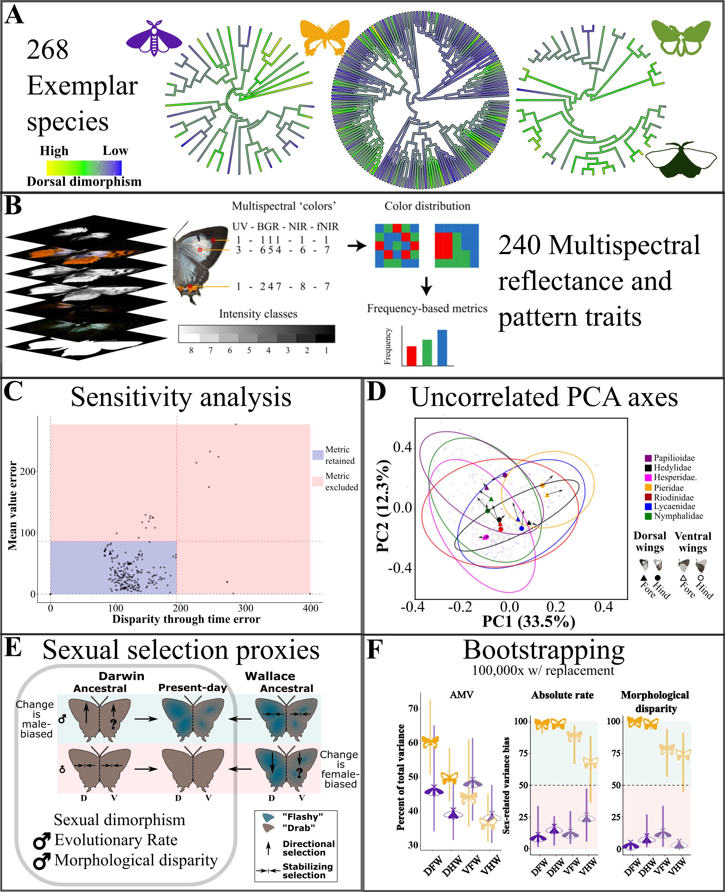
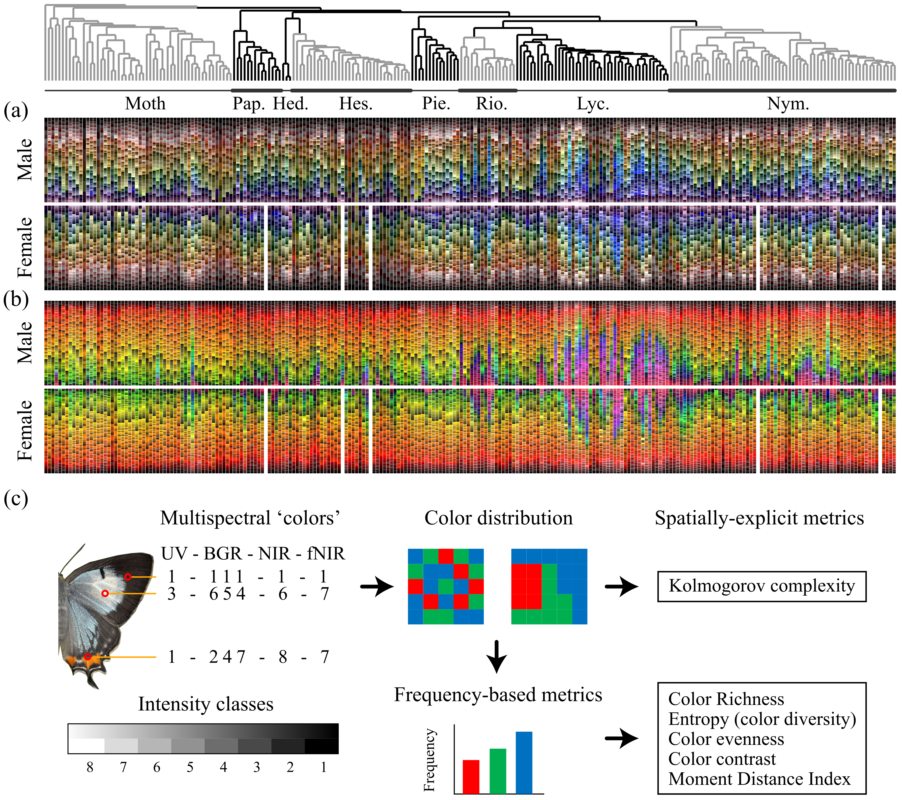

# Multispectral-sex-selection-walkthrough
A walkthrough of the multispectral data processing and sexual selection proxy metrics analysis code and analysis that I conducted for the paper analyzing morphological proxies of sexual selection that show Darwinian male-biased evolution of sexual dimorphism in day- vs night -flying lepidoptera. The pipeline and analysis is written as a series of python or R scripts, submitted as individual scripts in a SLURM HPC environment via sbatch. Plotting scripts are run locally in Rstudio.

## Introduction
This repository contains a guided walkthrough of the data analysis and pipeline I developed in our study, which uses morphological proxies of sexual selection based on multispectral reflectance, color and pattern information to determine whether butterfly wing color and pattern evolution conforms more broadly to a Darwinian model of male-biased evolution based on female choice or Wallacean mode of female-biased evolution based on sex-specific natural selection. I begin by augmenting the reflectance based trait metrics produced by our multispectral imaging pipeline (Chan, Rabideau Childers and Ashe, _et al._ 2022, [https://doi.org/10.1038/s42003-022-04282-z]) with custom multispectral 'color-' and pattern-based trait metrics. As this approach is designed to be used with samplings across high-level exemplar phylogenies, I employ a bootstrapping sensitvity analysis to restrict the analysis to those metrics that do not vary too wildly (or at all) across the selected taxonomic scales. I then use PCA via Singular Vector Decomposition to convert the remaining metrics, which by nature are highly intercorrelated with each other and cannot therefore be analyzed independently, into uncorrelated morphological axes of variation. Though direct tests of trait effects on fitness would be preferable, but unfeasible at the scale of a macroevolutionary dataset such as this, I implement my own workflow, quantifying for each axis the sexual dimorphism (by several measures), and male biased rates of evolution or morphological disparity that have been established in previous work as morphological proxies of sexual selection.  Given that these morphological axes are uncorrelated and share a common unit space, sex-based variation can be quantified and summed across these axes to yield overall summaries of the level of dimorphism and sexual bias in absolute rate and morphological disparity across entire taxonomic groups (e.g. 'butterflies,' 'day-flying geometrids' or 'nocturnal moths'), which can be directly compared against findings from other groups or even other studies  by expressing them as a function of the overall morphospace variance.

## Datasets and Scripts
- **Datasets**: Available through Dryad [FAKELINKREPLACE]
- **Analysis Scripts**: Published on Zenodo [FAKELINKREPLACE]

## Statistical Analysis Walkthrough
The following is a step-by-step guide through the analyses performed in our study, accompanied by visualizations of our findings.

### Calculating and compiling a range of augmented multispectral 'color' and pattern metrics from raw .mat files

The following code comprises a python script which uses data from '8-bit' color matrices produced by the multispectral imaging pipeline in Chan, Rabideau Childers and Ashe, _et al._ 2022. These are then read in for each specimen side, with each mat file comprised of a series of multispectral 'color names,' essentially a concatenation of the intensity values of each wavelength band ranging in intensity from 1 (0 reflectance) to 8 (maximum reflectance), which are treated as a kind of 'color species' from which a range of color and pattern metrics are calculated, based on ecological diversity, richness and evenness metrics like Shannon-Weaver entropy or multispectral color contrast. See Extended data figures for more details. Arguments include the bodypart (specified in each pixel of the .mat files), as well as the channel start and stops, which determine over which range of the multispectral wavelength bands (UV, B, G, R, 740nm, 940nm) will these metrics be calculated, as well a taxonomic prefix to differentiate from other taxa being studied.
- **Code**: generalized_color_metrics_alltaxa_FINAL.py, commandlineoptions_generalized_color_metrics_py_generalized.sh 
- **Submission code**: sbatch commandlineoptions_generalized_color_metrics_py_generalized.sh '/path/to/8bitmatrices/' \
  /path/to/moth_specimen_matrices_list.txt' 'BODYPART' [CHANNEL START] [CHANNEL STOP] 'TAXON'

  The above sbatch script will be submitted separately for each desired combaintion of channel ranges, body parts and taxa after which it will be compiled using the following code:

- **Code**: generalized_color_metrics_alltaxa_results_compiler_FINAL.py, generalized_color_metrics_alltaxa_results_compiler_py_GENERIC.sh 
- **Submission code**: sbatch generalized_color_metrics_alltaxa_results_compiler_py_GENERIC.sh
  
The submission should be edited by the user to the correct arguments for -d the directory where the color palette .p files output by the generalized_color_metrics_alltaxa_FINAL.py script are located and -m for the matrix_var_file, a ser supplied csv file with the column names 'Taxon_groups' 'Body_parts' 'Channel_groups' in that order. All are read as strings though body parts are the numeric codes for the different body parts detected by our pipeline. Channel groups must be specified as 'C[x]_to_X[y]'' where x is the start channel and y is the stop channel output by the color palette script (0=UV to 6=nIR).
The following code will produce such a data frame, as an example:
Taxon_groups=['Butterflies','Moths']
Body_parts=['1','2','3','4','5','6']
Channel_groups=['C0_to_C6','C0_to_C5','C0_to_C4','C1_to_C4','C5_to_C6']
iteration_frame=pd.DataFrame(list(product(Taxon_groups,Body_parts,Channel_groups )),columns=['Taxon_groups','Body_parts','Channel_groups'])
iteration_frame.to_csv('color_palette_metrics_compilation_input_variable_dataframe.csv', index=False)

This will then produce a pickle file which is used by the following metadata matching code to produce the final "Trait data frame" used as input to the sensitivity and subsequent analyses.

- **Code**: compile_master_trait_databases_and_split_by_metadata_FINAL.py, generalized_color_metrics_alltaxa_results_compiler_py_GENERIC.sh 
- **Submission code**: sbatch generalized_color_metrics_alltaxa_results_compiler_py_GENERIC.sh

this script takes the following options "-c", filename of the color palette .p file output by generalized_color_metrics_alltaxa_results_compiler.py assumes current directory.
"-d", filename of the .csv file in the current directory that lists the complete filenames of the metric datasets to be joined together under a column titled 'Metric_datasets'
"-m", filename of the .csv file in the current directory that lists the complete filenames of the metadata datasets that will be intersected via 'Specimen' values with the compiled data. Requires 'Metadata_datasets' 'Grouping_variables' 'ID_variable' 'Taxon_group' columns. which contain metadata filenames, a list of user supplied grouping variables in the format ['var1','var2',...], the unique species ID variable name and the taxon group name, respectively
"-s" whether to save the overall trait database before splitting by metadata (can be large).

The out of this script is a final trait data frame (or frames, if multiple rows for multiple groups of metadata were supplied to the metadata datasets dataframe.
These can then be analyzed via the sensitivity analyses to restrict further analyses to metrics which are not prone to bad sampling bias at these taxonomic scales.
  
